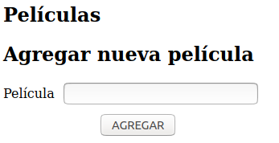
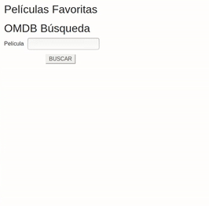

# Redux OMDB APP

En este ejercicio vamos a crear una APP que utilice la API de [OMDB](http://www.omdbapi.com/). Vamos a crear nuestra app utilizando __REACT__ y __REDUX__.

> Vamos a necesitar una APIKEY ya que la API de OMDB es paga. Usen `apikey=20dac387`

Con tu App podremos:

* Buscar películas y listarlas.
* Poder ver todos los detalles de una película en particular.
* Poder agregar las películas a tu lista de favoritos.
* Poder sacar películas de tu lista de favoritos.

## Estructura

Agregar las carpetas actions, components, constants, middleware, reducers y store para que que la estructura de carpetas quede de la siguiente forma:

```bash.
├── public
├── src
│   ├── /actions
│   ├── /components
│   ├── /constants
│   ├── /middleware
│   ├── /reducers
│   ├── /store
│   ├── App.css
│   ├── App.js
│   ├── App.test.js
│   ├── index.css
│   ├── index.jss
│   ├── serviceWorker.js
│   └── setupTests.js
├── .gitignore
├── package-lock.json
├── package.json
└── README.md
```

* __src__: Carpeta donde estará el código fuente del front-end de nuestra app.
    * __actions__: Imágenes y otros archivos estáticos.
    * __components__: Todos nuestros componentes de REACT junto con su CSS.
    * __constants__: Constantes a utilizar por la aplicación
    * __middleware__:  Intermediario que va a ser utilizado para validaciones
    * __reducers__: Todos los reducers definidos irán aquí
    * __store__: Mantiene todo el estado de la aplicación
    * __App.js__: Aplicación principal
    * __index.js__: Punto de partida de nuestra aplicación

Antes de empezar a codear, vamos a pensar un diseño para nuestra página y hacer una lista con los __componentes__ y __containers__ que vamos a tener.
Empezaremos por los más pequeños y simples (los puramente presentacionales sobre todo).
Cuando nos toque crear un __container__ de _Redux_ pensaremos las props del _Estado_ que vamos a mapear al container y las acciones que van a disparar. Luego codearemos primero las acciones, luego los reducers y por último el Container.

### Rutas

Nuestra aplicación tiene que tener un set de rutas ya definido para hacer la pagina navegable.

* `/`: la ruta de home que tiene un input para hacer la búsqueda.
* `/search`: tiene que mostrar los resultados de la búsqueda (un listado de resultados).
* `/movie/:movieId`: muestra los detalles de una película en particular.
* `/favs/`: muestra un listado de las películas favoritas, (cuando tengamos usuarios puede que esta ruta cambie).

> Para poder emular lo de guardar a favoritos, vamos a guardar las películas favoritas en el __Estado__ de nuestra aplicación.

### Instrucciones

1. Crear un reducer en la carpeta `reducers` que contenta un estado inicial de `favoritos` y por el momento que únicamente devuelva dicho estado. Recordar que es necesario pasarle una acción como segundo parámetro al reducer para indicarle que es lo que pretendemos que realice.

2. Crear el archivo `index.js` dentro de la carpeta `store` e inicializarlo con el método `createStore` que reciba como parámetro el reducer previamente creado.

3. Crear un archivo `index.js` dentro de la carpeta `actions` y dentro del mismo crear una acción que llamaremos `addFavorito` para indicarle al reducer que queremos agregar una nueva película a nuestro listado de favoritos. Recordemos que las acciones de Redux no son más que objetos Javascript con dos propiedades: `type` y `payload`. En nuestro caso el `type` va a ser el nombre de la acción que definiremos como `ADD_FAVORITO` y el payload contendrá los datos de dicha película.

4. [Opcional] Una buena práctica consiste en definir los nombres de las acciones que son strings dentro de un archivo destinado a constantes para evitar errores de tipeo o duplicados, por lo tanto crear un archivo denominado `action-types.js` en la carpeta `constants` y definir allí una constante para utilizar en la acción recién creada (No olvidarse de actualizar el archivo de `actions`).

5. Actualizar el reducer para que si la acción que recibe es la de `ADD_FAVORITO`, agregue al estado de la aplicación la película que se encuentra en su payload. [Investigar el principio de inmutabilidad de Redux para encontrar la forma correcta de agregar un nuevo elemento al array del estado inicial]

6. Ahora debemos conectar Redux con nuestra aplicación de React. Agregar un `Provider` del módulo de `react-redux` en nuestra aplicación (Archivo `App.js` de la carpeta `src`) para que la aplicación de React tenga conocimiento del store de Redux.

7. Crear los componentes que crean necesarios para el frontend de nuestra aplicación. El diseño de la misma debe ser algo similar a:

<div style="text-align:center"></div><br>

8. Conectar el estado del store donde se encuentra el listado de películas favoritas con el componente que corresponda utilizando `mapStateToProps` y mapearlo para que se visualicen dentro de dicho componente.

9. Crear un formulario conectado que va a ser el encargado de agregar nuevas películas al estado global de la aplicación utilizando `mapDispatchToProps`. [Por el momento nos olvidaremos de la API y lo haremos de forma manual para verificar que funcione correctamente por lo que tendremos que tomar los valores de la película de un input]

__STOP__

* A esta altura del ejercicio, antes de continuar agregando más funcionalidad, deberíamos ya poder correr nuestra aplicación y comprobar la conexión entre nuestros componentes de React y el estado global de la aplicación manejado con Redux. Deberían lograr lo siguiente (Sin considerar cuestiones estéticas en nuestro caso):

<div style="text-align:center"></div><br>

__CONTINUEMOS__

10. Ahora queremos obtener un listado de películas desde la API (Consultar la documentación [acá](http://www.omdbapi.com/)) y para ello deberán crear una nueva acción a la que llamaremos `getData`, que recibirá el como parámetro el input que ingrese el usuario como filtro de búsqueda. [Recordar la utilización de un middlewares para manejar correctamente los request http]

11. Modificar el reducer para que tome en cuenta esta nueva acción y guarde las películas recibidas en el estado global de la aplicación.

11. Mostrar todas las películas que retorne la API en un nuevo componente.

__STOP__

Veamos que tenemos hasta el momento. Por un lado la primer parte que realizamos simula el agregado de películas a nuestro listado de favoritos (Hasta el momento lo estamos realizando manualemnte ingresando el título de la película que queremos y clickeando el botón de `AGREGAR`). Por otro lado en la segunda parte logramos obtener todas las películas provenientes de la API a partir de un título ingresado en el formulario.

Por lo tanto el siguiente paso consistiría en actulizar el componente donde renderizamos cada película para agregar la posibilidad de clickear un botón y que la misma sea agregada o quitada directamente de la lista de favoritos.

<div style="text-align:center"></div><br>

__CONTINUEMOS__

12. Agregar un botón de favorito a cada película del listado general y que al clikearlo se añada a la lista de favoritos y otro botón en la lista de favoritos para quitarlas de allí al hacer click.

13. Mejorar la interfaz de usuario. Hasta el momento tenemos renderizados todos los componentes en una misma página por lo que ahora convendría separarlo en distintas rutas según lo indicado en el apartado de `rutas` de este documento

14. Permitir clickear una película para acceder a la información completa de la misma y que redirija a la ruta `/movie/:movieId`. El ID de la película es el de OMDB y con el debemos realizar un request a la API para obtener los siguientes datos de dicha película:

  * Título [Title]
  * Año [Year]
  * Calificación [Rated]
  * Fecha de Estreno [Released]
  * Duración [Runtime]
  * Género [Genre]
  * Descripicón [Plot]
  * Actores [Actors]
  * Puntuación [imdbRating]

### Extras

* Agregar un custom middleware que valide que las películas que estemos agregando a favoritos no esten ya incluidas

* Implementar animaciones con estos [addOns](https://facebook.github.io/react/docs/animation.html) de React.

* Diferenciar la búsqueda entre series y películas, ¿esto implicaría crear otra ruta?
